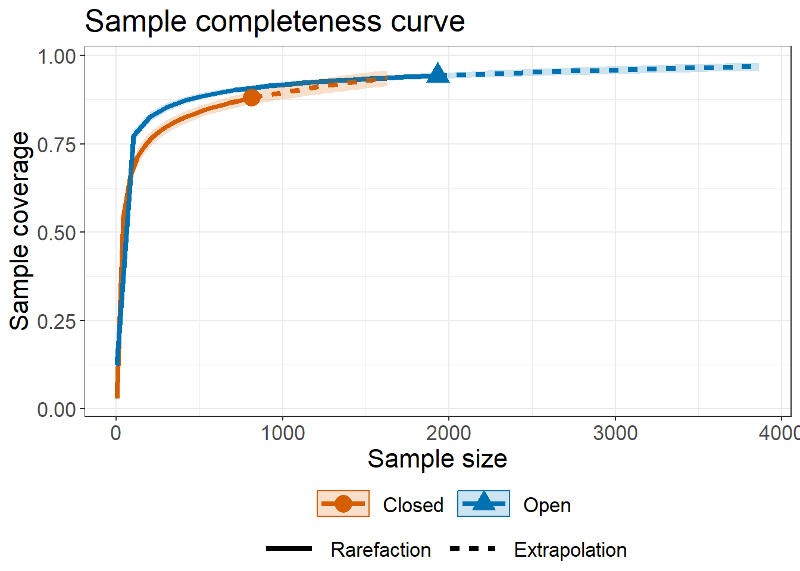
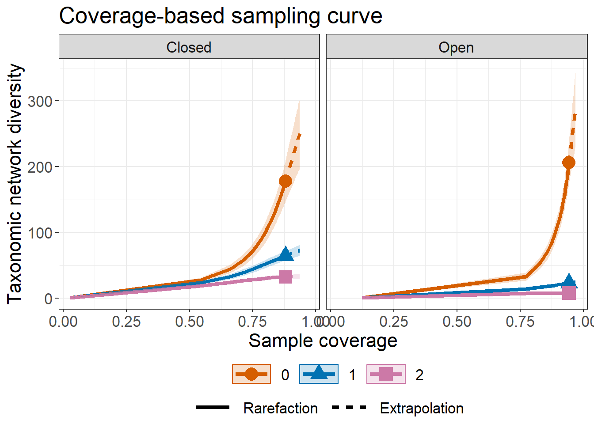
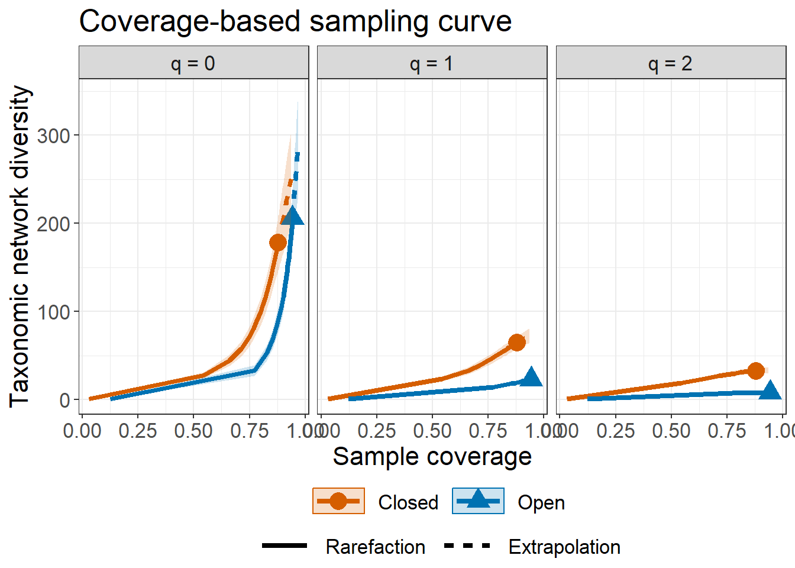
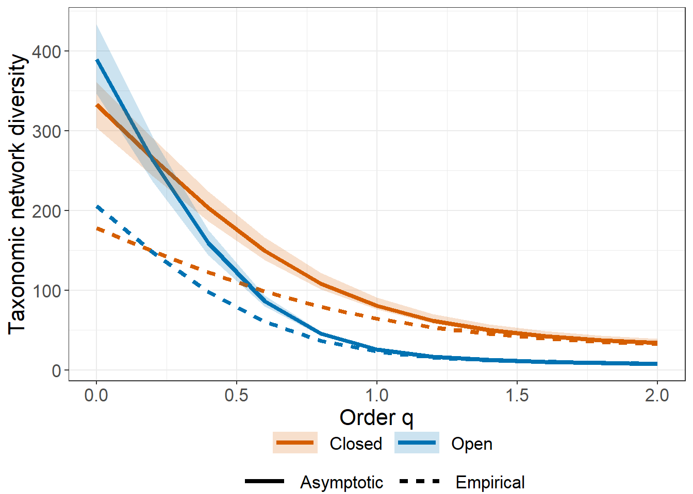
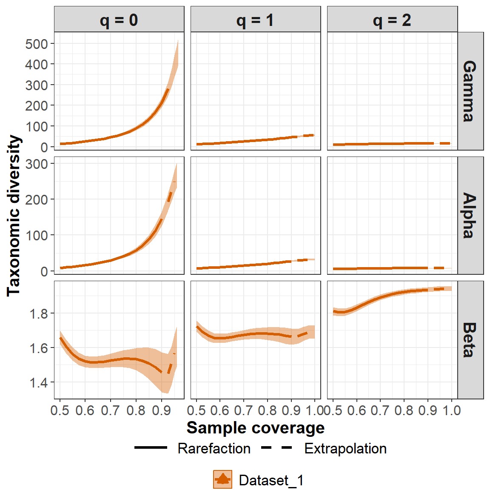
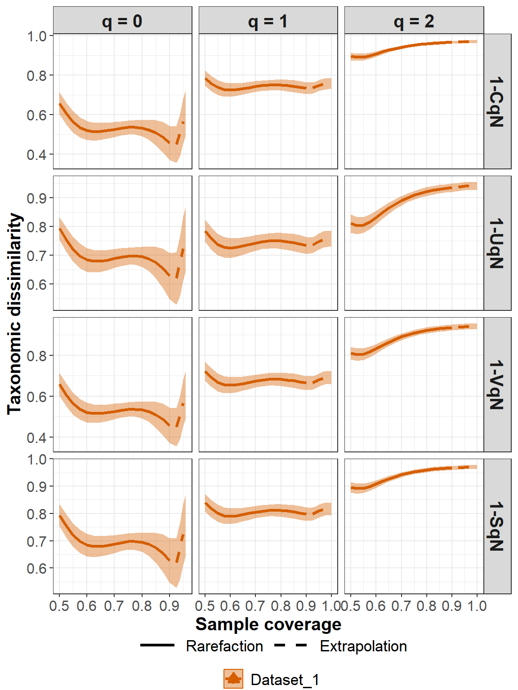

<!-- README.md is generated from README.Rmd. Please edit that file -->

# iNEXT.link (R package)

<h5 align="right">
Latest version: 2023-08-31
</h5>
<font color="394CAE">
<h3 color="394CAE" style="font-weight: bold">
Introduction to iNEXT.link (R package): Excerpt from iNEXT.link
UserGuide
</h3>
</font> <br>
<h5>
<b>Anne Chao, K.S. Hu, K.W. Chen, C.G. Lo, S.Y. Wang</b> <br><br>
<i>Institute of Statistics, National Tsing Hua University, Hsin-Chu,
Taiwan 30043</i>
</h5>

<br> `iNEXT.link` (INterpolation and EXTrapolation in Network diversity)
is an R package, available in [Github](https://github.com/AnneChao).
Here we provide a quick introduction demonstrating how to run
iNEXT.link. An online version of [iNEXT.link
Online](https://chao.shinyapps.io/iNEXT_link/) is also available for
users without an R background. Detailed information about all functions
in iNEXT.link is provided in the iNEXT.link Manual in
[iNEXT.link_vignettes](http://chao.stat.nthu.edu.tw/wordpress/wp-content/uploads/software/A%20Quick%20Introduction%20to%20iNEXT.link%20via%20Examples.html),
which is also available from [Anne Chao’s
website](http://chao.stat.nthu.edu.tw/wordpress/software_download/).

`iNEXT.link` is an R package that extends the concepts of `iNEXT.3D`
(Chao et al., 2021), `iNEXT.4step` (Chao et al., 2020) and
`iNEXT.beta3D` (Chao et al., 2023) to ecological networks (Chiu et al.,
2023). It is primarily designed to calculate and analyze various
measures of diversity in ecological networks. Specifically, the package
calculates three Hill numbers of order q (species richness, Shannon
diversity, and Simpson diversity) in taxonomic diversity level, as well
as phylogenetic and functional diversity levels.

For single ecological networks, `iNEXT.link` provides tools for
analyzing diversity. The package provides two types of rarefaction and
extrapolation (R/E) sampling curves to estimate diversity and confidence
intervals for single ecological networks. These include
sample-size-based (or size-based) R/E curves and coverage-based R/E
curves.

Moreover, `iNEXT.link` offers dissimilarity-turnover curves for the
coverage-based R/E curves for gamma, alpha, and beta diversity measures,
which can be used to compare diversity patterns across different
ecological networks.

### SOFTWARE NEEDED TO RUN INEXT.3D IN R

-   Required: [R](http://cran.rstudio.com/)
-   Suggested: [RStudio IDE](http://www.rstudio.com/ide/download/)

### HOW TO RUN iNEXT.link:

The `iNEXT.link` package can be downloaded from Anne Chao’s
[iNEXT.link_github](https://github.com/AnneChao/iNEXT.link) using the
following commands. For a first-time installation, additional
visualization extension packages (`ggplot2`) from CRAN and (`iNEXT.3D`),
(`iNEXT.4steps`), and (`iNEXT.beta3D`) from Anne Chao’s github must be
installed and loaded.

``` r
## install iNEXT.link package from CRAN
# install.packages("iNEXT.link")  # coming soon

## install the latest version from github
install.packages('devtools')
library(devtools)

# install_github('AnneChao/iNEXT.3D')
# install_github('AnneChao/iNEXT.4steps')
# install_github('AnneChao/iNEXT.beta3D')

install_github('AnneChao/iNEXT.link')

## import packages
library(iNEXT.link)
```

In this document, we provide a quick introduction demonstrating how to
run the package `iNEXT.link`(iNterpolation and EXTrapolation in Network
diversity). `iNEXT.link` has several main functions:

## Functions for Single community:

-   **iNEXT.link** : Computes rarefaction/extrapolation taxonomic,
    phylogenetic, and functional diversity estimates and sample coverage
    estimates.

-   **DataInfo.link** : exhibits basic data information

-   **estimateD.link** : computes species diversity with a particular
    user-specified level of sample size or sample coverage.

-   **AO.link**: compute asymptotic or empirical(observed) diversity of
    order q.

-   **Completeness.link** : Calculates estimated sample completeness
    with order q.

-   **Spec.link** : Computes standardized specialization estimation
    under specified sample coverage(or observed) with order q.

## Function for Multi-community:

-   **iNEXTbeta.link** : Computing standardized gamma, alpha, beta
    diversity, and four dissimilarity-turnover indices for three
    dimensions: taxonomic, phylogenetic and functional diversity at
    specified sample coverage.

## Functions for Visualizing Results:

-   **ggCompleteness.link** : Visualizing the output from the function
    `Completeness.link`

-   **ggSpec.link** : Visualizing the output from the function
    `Spec.link`

-   **ggAO.link** : Visualizing the output from the function `AO.link`

-   **ggiNEXT.link** : Visualizing the output from the function
    `iNEXT.link`

-   **ggiNEXTbeta.link** : Visualizing the output from the function
    `iNEXTbeta.link`

First, we load data from `iNEXT.link`:

#### SINGLE COMMUNITY FUNCTION: iNEXT.link()

We first describe the main function `iNEXT.link()` with default
arguments:

``` r
iNEXT.link(data,diversity = "TD", q = c(0, 1, 2), size = NULL, nT = NULL,
           endpoint = NULL, knots = 40, conf = 0.95, nboot = 30, 
           row.tree = NULL, col.tree = NULL, PDtype = "meanPD", 
           row.distM = NULL, col.distM = NULL, FDtype = "AUC", FDtau = NULL)
```

The arguments of this function are briefly described below, and will be
explained in more details by illustrative examples in later text.This
main function computes diversity estimates of order q, the sample
coverage estimates and related statistics for K (if `knots = K`)
evenly-spaced knots (sample sizes) between size 1 and the `endpoint`,
where the endpoint is described below. Each knot represents a particular
sample size for which diversity estimates will be calculated. By
default, endpoint = double the reference sample size (total sample size
for interaction data (so calles abundance data in iNEXT.3D)). For
example, if `endpoint = 10`, `knot = 4`, diversity estimates will be
computed for a sequence of samples with sizes (1, 4, 7, 10).

<table class="gmisc_table" style="border-collapse: collapse; margin-top: 1em; margin-bottom: 1em;">
<thead>
<tr>
<th style="font-weight: 900; border-bottom: 1px solid grey; border-top: 2px solid grey; text-align: center;">
Argument
</th>
<th style="font-weight: 900; border-bottom: 1px solid grey; border-top: 2px solid grey; text-align: center;">
Description
</th>
</tr>
</thead>
<tbody>
<tr>
<td style="text-align: left;">
data
</td>
<td style="text-align: left;">
a list of data.frames, each data.frames represents
col.species-by-row.species abundance matrix.
</td>
</tr>
<tr>
<td style="text-align: left;">
diversity
</td>
<td style="text-align: left;">
selection of diversity type: ‘TD’ = Taxonomic diversity, ‘PD’ =
Phylogenetic diversity, and ‘FD’ = Functional diversity.
</td>
</tr>
<tr>
<td style="text-align: left;">
q
</td>
<td style="text-align: left;">
a numerical vector specifying the diversity orders. Default is c(0, 1,
2).
</td>
</tr>
<tr>
<td style="text-align: left;">
size
</td>
<td style="text-align: left;">
an integer vector of sample sizes for which diversity estimates will be
computed. If NULL, then diversity estimates will be calculated for those
sample sizes determined by the specified/default endpoint and knots.
</td>
</tr>
<tr>
<td style="text-align: left;">
endpoint
</td>
<td style="text-align: left;">
an integer specifying the sample size that is the endpoint for R/E
calculation; If NULL, then endpoint=double the reference sample size;
</td>
</tr>
<tr>
<td style="text-align: left;">
knots
</td>
<td style="text-align: left;">
an integer specifying the number of equally-spaced knots between size 1
and the endpoint. Default is 40.
</td>
</tr>
<tr>
<td style="text-align: left;">
conf
</td>
<td style="text-align: left;">
a positive number \< 1 specifying the level of confidence interval.
Default is 0.95.
</td>
</tr>
<tr>
<td style="text-align: left;">
nboot
</td>
<td style="text-align: left;">
a positive integer specifying the number of bootstrap replications when
assessing sampling uncertainty and constructing confidence intervals.
Enter 0 to skip the bootstrap procedures. Default is 30.
</td>
</tr>
<tr>
<td style="text-align: left;">
row.tree
</td>
<td style="text-align: left;">
(required only when diversity = ‘PD’ a phylogenetic tree of row
assemblage in the pooled network row assemblage.
</td>
</tr>
<tr>
<td style="text-align: left;">
col.tree
</td>
<td style="text-align: left;">
(required only when diversity = ‘PD’) a phylogenetic tree of column
assemblage in the pooled network column assemblage.
</td>
</tr>
<tr>
<td style="text-align: left;">
PDtype
</td>
<td style="text-align: left;">
(required only when diversity = ‘PD’), select PD type: PDtype = ‘PD’
(effective total branch length) or PDtype = ‘meanPD’ (effective number
of equally divergent lineages). Default is ‘meanPD’, where meanPD =
PD/tree depth.
</td>
</tr>
<tr>
<td style="text-align: left;">
row.distM
</td>
<td style="text-align: left;">
(required only when </code>diversity = ‘FD’) a species pairwise distance
matrix for all species of row assemblage in the pooled network row
assemblage.
</td>
</tr>
<tr>
<td style="text-align: left;">
col.distM
</td>
<td style="text-align: left;">
(required only when diversity = ‘FD’) a species pairwise distance matrix
for all species of column assemblage in the pooled network column
assemblage.
</td>
</tr>
<tr>
<td style="text-align: left;">
FDtype
</td>
<td style="text-align: left;">
(required only when diversity = ‘FD’), select FD type: FDtype =
‘tau_values’ for FD under specified threshold values, or FDtype = ‘AUC’
(area under the curve of tau-profile) for an overall FD which integrates
all threshold values between zero and one. Default is ‘AUC’.
</td>
</tr>
<tr>
<td style="border-bottom: 2px solid grey; text-align: left;">
FDtau
</td>
<td style="border-bottom: 2px solid grey; text-align: left;">
(required only when diversity = ‘FD’ and FDtype = ‘tau_values’), a
numerical vector between 0 and 1 specifying tau values (threshold
levels). If NULL (default), then threshold is set to be the mean
distance between any two individuals randomly selected from the pooled
assemblage (i.e., quadratic entropy).
</td>
</tr>
</tbody>
</table>

## DATA FORMAT/INFORMATION

Supported Data Types:

Individual-based interaction data : Input data matrix for each
assemblage/site include samples species interactions in an empirical
sample of n total interactions (“reference sample”). When dealing with N
networks, the input data consists of N lists of species interaction
matrix.

## RAREFACTION/EXTRAPOLATION VIA EXAMPLES

The data set (tree-beetles interaction data) is included in iNEXT.link
package. The experiment took place in the Steigerwald forest in Germany,
where deadwood objects from six tree species were exposed in open, net,
and closed habitats. In each habitat, there are six plots (A, B, C, D,
E, F). Saproxilic beetles were sampled using stem emergence traps and
classified according to their functional traits. Data from four years
were pooled for each plot and habitat, and pairwise distances were
computed from the Gower distance. Here, the demonstration only uses data
from plot A in each habitat. For these data, the following commands
display the sample species interactions and run the `iNEXT.link()`
function for three types of diversty (`"TD"`, `"PD"`, `"FD"` with
specified threshold (default is dmean (quadratic entropy)), `"AUC"`
which integrates FD from threshold 0 to 1).

Under taxonomic diversity dimension, `iNEXT.link()` function returns
including: `$DataInfo` for summarizing data information; `$iNextEst` for
showing diversity estimates along with related statistics for a series
of rarefied and extrapolated samples; and `$AsyEst` for showing
asymptotic diversity estimates along with related statistics. Result
under phylogenetic diversity or functional diversity includes these
three parts, too.

`$DataInfo` in TD example, as shown below, returns basic data
information. It can also be presented using function `DataInfo.link()`
to get the same result.

Because the three kinds of diversity output are similar, the demo shows
TD only.

``` r
linkoutTD = iNEXT.link(data = beetles, diversity = 'TD', q = c(0,1,2), nboot = 30)
linkoutTD$DataInfo
  Networks    n S.obs(row) S.obs(col) Links.obs Connectance Coverage  f1 f2 f3 f4 f5 f6 f7 f8 f9 f10
1   Closed  816          6         83       178      0.3574   0.8800  98 31 15  3  3  5  0  2  2   1
2     Open 1932          6         88       206      0.3902   0.9431 110 33 15  8  7  5  3  2  3   2
```

Second part of output from function `iNEXT.link` is diversity estimates
and related statistics computed for these 40 knots by default, which
locates the reference sample size at the mid-point of the selected
knots. The diversity can be based on sample-size-based and sample
coverage-based. The first data frame of list `$iNextEst` (as shown below
for ‘size_based’) includes the sample size (`m`), the `Method`
(`Rarefaction`, `Observed`, or `Extrapolation`, depending on whether the
size `m` is less than, equal to, or greater than the reference sample
size), the diversity order (`Order.q`), the diversity estimate of order
q (`qD` in TD, `qPD` in PD, `qFD` in FD (under specified thresholds),
`qAUC` in FD (area under curve)), the lower and upper confidence limits
of diversity (`qD.LCL` and `qD.UCL` in TD, `qPD.LCL` and `qPD.UCL` in
PD, `qFD.LCL` and `qFD.UCL` in FD (under specified thresholds),
`qAUC.LCL` and `qAUC.UCL` in FD (area under curve)) conditioning on
sample size, and the sample coverage estimate (`SC`) along with the
lower and upper confidence limits of sample coverage (`SC.LCL`,
`SC.UCL`). These sample coverage estimates with confidence intervals are
used for plotting the sample completeness curve. It is time consuming
for `diversity = FD` and `FDtype = "AUC"`. If the argument `nboot` is
greater than zero, then the bootstrap method is applied to obtain the
confidence intervals for each diversity and sample coverage estimates.

Here only show first six rows:

``` r
head(linkoutTD$iNextEst$size_based)
# A tibble: 6 x 10
  Assemblage     m Method      Order.q    qD qD.LCL qD.UCL     SC SC.LCL SC.UCL
  <chr>      <dbl> <chr>         <dbl> <dbl>  <dbl>  <dbl>  <dbl>  <dbl>  <dbl>
1 Closed         1 Rarefaction       0   1      1      1   0.0295 0.0263 0.0326
2 Closed        43 Rarefaction       0  28.0   27.1   29.0 0.543  0.515  0.570 
3 Closed        86 Rarefaction       0  44.8   42.8   46.8 0.661  0.635  0.687 
4 Closed       129 Rarefaction       0  58.2   55.1   61.2 0.713  0.690  0.737 
5 Closed       172 Rarefaction       0  69.8   65.8   73.7 0.745  0.724  0.766 
6 Closed       215 Rarefaction       0  80.2   75.5   85.0 0.767  0.747  0.788 
```

The second data frame of list `$iNextEst` (as shown below for
‘coverage_based’) includes the sample coverage estimate (‘SC’), the
sample size (`m`), the `Method` (`Rarefaction`, `Observed`, or
`Extrapolation`, depending on whether the size `m` is less than, equal
to, or greater than the reference sample size), the diversity order
(`Order.q`), the diversity estimate of order q (`qD` in TD, `qPD` in PD,
`qFD` in FD (under specified thresholds), `qAUC` in FD (area under
curve)), the lower and upper confidence limits of diversity (`qD.LCL`
and `qD.UCL` in TD, `qPD.LCL` and `qPD.UCL` in PD, `qFD.LCL` and
`qFD.UCL` in FD (under specified thresholds), `qAUC.LCL` and `qAUC.UCL`
in FD (area under curve)) conditioning on sample coverage estimate.

Here only show first six rows:

``` r
head(linkoutTD$iNextEst$coverage_based)
# A tibble: 6 x 8
  Assemblage     SC      m Method      Order.q    qD qD.LCL qD.UCL
  <chr>       <dbl>  <dbl> <chr>         <dbl> <dbl>  <dbl>  <dbl>
1 Closed     0.0295   1.00 Rarefaction       0  1.00  0.967   1.03
2 Closed     0.543   43.0  Rarefaction       0 28.0  24.7    31.4 
3 Closed     0.661   86.0  Rarefaction       0 44.8  38.3    51.2 
4 Closed     0.713  129.   Rarefaction       0 58.2  49.4    66.9 
5 Closed     0.745  172.   Rarefaction       0 69.8  59.0    80.5 
6 Closed     0.767  215.   Rarefaction       0 80.2  67.8    92.7 
```

The output `$AsyEst` lists the diversity labels (`Diversity` in TD,
`Phylogenetic Diversity` in PD, `Functional Diversity` in FD), the
observed diversity (`Observed` in TD, `Phylogenetic Observed` in PD,
`Functional Observed` in FD), asymptotic diversity estimates
(`Estimator` in TD, `Phylogenetic Estimator` in PD,
`Functional Estimator` in FD), estimated bootstrap standard error
(`s.e.`) and confidence intervals for diversity with q = 0, 1, and 2
(`LCL`, `UCL`). The estimated asymptotic and observed diversity can also
be computed via the function `AO.link()`. The output are shown below:

Here only show first six rows:

``` r
head(linkoutTD$AsyEst)
  Assemblage         Diversity   Observed  Estimator       s.e.        LCL        UCL
1     Closed  Species richness 178.000000 332.713393 31.1752765 271.610974 393.815813
2     Closed Shannon diversity  64.690053  80.316088  4.1719161  72.139283  88.492894
3     Closed Simpson diversity  32.627205  33.944467  2.2120701  29.608889  38.280045
4       Open  Species richness 206.000000 389.238440 33.3141682 323.943870 454.533010
5       Open Shannon diversity  23.311453  25.911799  0.9921214  23.967277  27.856321
6       Open Simpson diversity   8.059978   8.089554  0.2130638   7.671957   8.507151
```

### GRAPHIC DISPLAYS: FUNCTION ggiNEXT.link()

The function `ggiNEXT.link()`, which extends `ggplot2` with default
arguments, is described as follows:

``` r
ggiNEXT.link(outcome, type = 1:3, facet.var = "Assemblage", color.var = "Order.q")  
```

Here `outcome` is the object of `iNEXT.link()`’s output. Three types of
curves are allowed for different diversity dimensions:

1.  Sample-size-based R/E curve (`type = 1`): This curve plots diversity
    estimates with confidence intervals as a function of sample size.

2.  Sample completeness curve (`type = 2`): This curve plots the sample
    coverage with respect to sample size.

3.  Coverage-based R/E curve (`type = 3`): This curve plots the
    diversity estimates with confidence intervals as a function of
    sample coverage.

The argument `facet.var = "Order.q"` or `facet.var = "Assemblage"` is
used to create a separate plot for each value of the specified variable.
For example, the following code displays a separate plot of the
diversity order q. The `ggiNEXT.link()` function is a wrapper with
package `ggplot2` to create a R/E curve in a single line of code. The
figure object is of class `"ggplot"`, so can be manipulated by using the
`ggplot2` tools.

When `facet.var = "Assemblage"` in `ggiNEXT.link` function, it creates a
separate plot for each network and the different color lines represent
each diversity order. Sample-size-based R/E curve (`type = 1`) as below:

``` r
# Sample-size-based R/E curves, separating by "assemblage""
ggiNEXT.link(linkoutTD, type = 1, facet.var = "Assemblage")
[[1]]
```


When `facet.var = "Order.q"` in `ggiNEXT.link` function, it creates a
separate plot for each diversity order and the different color lines
represent each network. Sample-size-based R/E curve (`type = 1`) as
below:

``` r
# Sample-size-based R/E curves, separating by "Order.q"
ggiNEXT.link(linkoutTD, type = 1, facet.var = "Order.q")
[[1]]
```


The following command return the sample completeness (sample coverage)
curve (`type = 2`) in which different colors are used for the three
networks.

``` r
ggiNEXT.link(linkoutTD, type = 2, facet.var = "Order.q", color.var = "Assemblage")
[[1]]
```



The following commands return the coverage-based R/E sampling curves in
which different colors are used for the three assemblages
(`facet.var = "Assemblage"`) and for three diversity orders
(`facet.var = "Order.q"`).

``` r
ggiNEXT.link(linkoutTD, type = 3, facet.var = "Assemblage")
[[1]]
```



``` r
ggiNEXT.link(linkoutTD, type = 3, facet.var = "Order.q")
[[1]]
```



### DATA INFORMATION FUNCTION: DataInfo.link()

``` r
DataInfo.link(data, diversity = "TD", row.tree = NULL, 
              col.tree = NULL, row.distM = NULL, col.distM = NULL) 
```

Here provide the function `DataInfo.link` to compute three diversity
dimensions (‘TD’, ‘PD’, ‘FD’) data information, which including sample
size, observed species richness, sample coverage estimate, and the first
ten interaction frequency counts when `diversity = TD`. And so on for
PD, FD.

``` r
DataInfo.link(beetles, diversity = 'TD')
  Networks    n S.obs(row) S.obs(col) Links.obs Connectance Coverage  f1 f2 f3 f4 f5 f6 f7 f8 f9 f10
1   Closed  816          6         83       178      0.3574   0.8800  98 31 15  3  3  5  0  2  2   1
2     Open 1932          6         88       206      0.3902   0.9431 110 33 15  8  7  5  3  2  3   2
DataInfo.link(beetles, diversity = 'PD', col.tree = beetles_col_tree)
  Networks    n S.obs(row) S.obs(col) Links.obs Connectance f1* f2*       g1       g2 PD.obs mean_T
1   Closed  816          6         83       178      0.3574  98  31 11508.99 3873.052    924    285
2     Open 1932          6         88       206      0.3902 110  33 13918.45 5172.410   1014    285
DataInfo.link(beetles, diversity = 'FD', col.distM = beetles_col_distM)
  Networks    n S.obs(row) S.obs(col) Links.obs Connectance  f1 f2 a1' a2' threshold
1   Closed  816          6         83       178      0.3574  98 31   0   0  8.930741
2     Open 1932          6         88       206      0.3902 110 33   0   0  8.021019
```

### POINT ESTIMATION FUNCTION: estimateD.link()

``` r
estimateD.link(data, diversity = "TD", q = c(0, 1, 2),  
               base = "coverage", level = NULL, nboot = 50, conf = 0.95, 
               PDtype = "meanPD", row.tree = NULL, col.tree = NULL, row.distM = NULL, 
               col.distM = NULL, FDtype = "AUC", FDtau = NULL) 
```

`estimateD.link` is used to compute three diversity dimensions (TD, PD,
FD) estimates with q = 0, 1, 2 under any specified level of sample size
(when `base = "size"`) or sample coverage (when `base = "coverage"`). If
`level = NULL`, this function computes the diversity estimates for the
minimum sample size among all samples extrapolated to double reference
sizes (when `base = "size"`) or the minimum sample coverage among all
samples extrapolated to double reference sizes (when
`base = "coverage"`).

For example, the following command returns the taxonomic diversity
(‘TD’) with a specified level of sample coverage of 95% for the
tree-beetles interaction data. For some networks, this coverage value
corresponds to the rarefaction part whereas the others correspond to
extrapolation, as indicated in the method of the output.

``` r
estimateD.link(beetles, diversity = 'TD', q = c(0, 1, 2), base = "coverage", level = 0.95)
  Assemblage   SC        m        Method Order.q         qD       s.e.     qD.LCL     qD.UCL
1     Closed 0.95 1944.292 Extrapolation       0 268.252103 26.4582800 216.394827 320.109379
2     Closed 0.95 1944.292 Extrapolation       1  74.577021  4.5977860  65.565526  83.588516
3     Closed 0.95 1944.292 Extrapolation       2  33.378889  1.8286390  29.794822  36.962955
4       Open 0.95 2349.132 Extrapolation       0 228.271774 16.1616117 196.595597 259.947950
5       Open 0.95 2349.132 Extrapolation       1  23.704215  1.0733930  21.600403  25.808026
6       Open 0.95 2349.132 Extrapolation       2   8.065214  0.2848699   7.506879   8.623548
```

### ASYMPTOTIC AND OBSERVED DIVERSITY FUNCTION: AO.link()

``` r
AO.link(data, diversity = "TD", q = seq(0, 2, 0.2),  nboot = 30, 
        conf = 0.95, method = c("Asymptotic", "Observed"), 
        row.tree = NULL, col.tree = NULL, PDtype = "meanPD", row.distM = NULL, 
        col.distM = NULL, FDtype = "AUC", FDtau = NULL)
```

The function `AO.link()` compute three diversity dimensions (TD, PD, FD)
for empirical (observed) diversity and estimated asymptotic diversity
with any diversity order. For example, the following commands returns
empirical and asymptotic taxonomic diversity (‘TD’) for dunes data,
along with its confidence interval at diversity order q from 0 to 2.
Here only show the first ten rows.

``` r
out1 <- AO.link(beetles, diversity = 'TD', q = seq(0, 2, 0.2), method = c("Asymptotic", "Observed"),
                nboot = 5,conf = 0.95)

out1
   Order.q         qD       s.e.     qD.LCL     qD.UCL Network     Method
1      0.0 332.713393 47.6339429 264.713598 382.952328  Closed Asymptotic
2      0.2 265.977501 34.6174453 215.331048 299.827893  Closed Asymptotic
3      0.4 203.167245 23.3553062 168.336598 224.074177  Closed Asymptotic
4      0.6 149.540048 14.6527608 127.490557 161.255012  Closed Asymptotic
5      0.8 108.592546  8.6879960  95.500774 115.588269  Closed Asymptotic
6      1.0  80.316088  5.0217924  72.722726  84.283473  Closed Asymptotic
7      1.2  61.983531  2.9695122  57.486378  64.454141  Closed Asymptotic
8      1.4  50.295815  1.9215576  47.504884  52.272936  Closed Asymptotic
9      1.6  42.699384  1.4443154  40.882291  44.516358  Closed Asymptotic
10     1.8  37.568079  1.2538592  36.340699  39.297767  Closed Asymptotic
11     2.0  33.944467  1.1868870  33.040037  35.611586  Closed Asymptotic
12     0.0 389.238440 47.7646970 343.387407 448.531820    Open Asymptotic
13     0.2 263.223968 30.1542543 231.442321 301.370141    Open Asymptotic
14     0.4 159.174040 16.4806654 140.310949 180.279271    Open Asymptotic
15     0.6  86.647814  7.7701721  77.219649  96.599799    Open Asymptotic
16     0.8  45.571274  3.4098289  41.548157  49.867582    Open Asymptotic
17     1.0  25.911799  1.6100479  24.295969  27.915712    Open Asymptotic
18     1.2  16.963237  0.9034461  15.860975  18.056868    Open Asymptotic
19     1.4  12.643810  0.6015139  11.834999  13.340102    Open Asymptotic
20     1.6  10.333946  0.4535803   9.696431  10.833443    Open Asymptotic
21     1.8   8.967960  0.3717088   8.433284   9.358168    Open Asymptotic
22     2.0   8.089554  0.3221836   7.617326   8.413607    Open Asymptotic
23     0.0 178.000000  7.7588659 170.200000 187.500000  Closed  Empirical
24     0.2 149.140436  7.5280512 140.581196 158.182492  Closed  Empirical
25     0.4 122.284123  7.1198567 113.370515 130.545727  Closed  Empirical
26     0.6  98.784711  6.5147978  90.019007 105.992205  Closed  Empirical
27     0.8  79.539008  5.7669976  71.367384  85.554654  Closed  Empirical
28     1.0  64.690053  4.9846188  57.369923  69.553727  Closed  Empirical
29     1.2  53.711702  4.2693738  47.290519  57.588955  Closed  Empirical
30     1.4  45.761569  3.6746674  40.148286  48.863305  Closed  Empirical
31     1.6  40.008527  3.2076497  35.058990  42.530385  Closed  Empirical
32     1.8  35.788959  2.8512496  31.359836  37.886709  Closed  Empirical
33     2.0  32.627205  2.5820378  28.597796  34.415644  Closed  Empirical
34     0.0 206.000000  6.6708320 196.800000 213.500000    Open  Empirical
35     0.2 147.911160  4.9466099 141.184481 153.761847    Open  Empirical
36     0.4  98.276240  3.4218954  93.591861 102.291322    Open  Empirical
37     0.6  60.906771  2.2109276  57.854181  63.350517    Open  Empirical
38     0.8  36.832763  1.3709137  34.924125  38.134790    Open  Empirical
39     1.0  23.311453  0.8609654  22.105863  24.174035    Open  Empirical
40     1.2  16.195155  0.5756396  15.388715  16.819711    Open  Empirical
41     1.4  12.394607  0.4179621  11.812580  12.867369    Open  Empirical
42     1.6  10.237828  0.3279282   9.786904  10.620150    Open  Empirical
43     1.8   8.920980  0.2740524   8.551053   9.249634    Open  Empirical
44     2.0   8.059978  0.2403748   7.742941   8.357278    Open  Empirical
```

### GRAPHIC DISPLAYS FUNCTION: ggAO.link()

``` r
ggAO.link(outcome)
```

`ggAO.link()` plots q-profile based on `ggplot2`. Here `outcome` is the
object from the function `AO.link`.

``` r
# q profile curve
ggAO.link(out1)
```



### SINGLE COMMUNITY FUNCTION: Completeness.link()

Function `Completeness.link()` provides a easy way to compute estimated
sample completeness with order q. The arguments is below:

``` r
Completeness.link(data, q = seq(0, 2, 0.2), nboot = 30, conf = 0.95) 
```

### GRAPHIC DISPLAYS FUNCTION: ggCompleteness.link()

We also provides a realized function `ggCompleteness.link` to plot the
output from `Completeness.link()`:

``` r
ggCompleteness.link(output)
```

Use data beetles to calculate sample completeness and plot it.

``` r
out1 <- Completeness.link(data = beetles)
ggCompleteness.link(out1)
```


### SINGLE COMMUNITY FUNCTION: Spec.link()

The main function `Spec.link()` with default arguments:

``` r
Spec.link(data, q = seq(0, 2, 0.2), method = "Estimated",
         nboot = 30, conf = 0.95, E.class = c(1:5), C = NULL) 
```

### GRAPHIC DISPLAYS FUNCTION: ggSpec.link()

The function `ggSpec.link()` is provided to plot the output from
`Spec.link()`.

``` r
ggSpec.link(output)
```

There is an example for function `Spec.link` and function `ggSpec.link`.

``` r
out1 <- Spec.link(data = beetles)
ggSpec.link(out1)
```


### MULTI-COMMUNITIES FUNCTION: iNEXTbeta.link()

``` r
iNEXTbeta.link(data, diversity = "TD", level = seq(0.5, 1, 0.05), 
               q = c(0, 1, 2), nboot = 20, conf = 0.95, 
               PDtype = "meanPD", row.tree = NULL, col.tree = NULL, row.distM = NULL, 
               col.distM = NULL, FDtype = "AUC", FDtau = NULL, FDcut_number = 30) 
```

The arguments of this function are briefly described below, and will be
explained in more details by illustrative examples in later text. This
main function computes gamma, alpha and beta diversity estimates of
order q at specified sample coverage and measures of dissimilarity. By
default of <code>base = “coverage”</code> and <code>level = NULL</code>,
then this function computes the gamma, alpha, beta diversity, and four
dissimilarity-turnover indices estimates up to one (for q = 1, 2) or up
to the coverage of double the reference sample size (for q = 0).

<table class="gmisc_table" style="border-collapse: collapse; margin-top: 1em; margin-bottom: 1em;">
<thead>
<tr>
<th style="font-weight: 900; border-bottom: 1px solid grey; border-top: 2px solid grey; text-align: center;">
Argument
</th>
<th style="font-weight: 900; border-bottom: 1px solid grey; border-top: 2px solid grey; text-align: center;">
Description
</th>
</tr>
</thead>
<tbody>
<tr>
<td style="text-align: left;">
data
</td>
<td style="text-align: left;">
data can be input as a matrix/data.frame (species by assemblages), or a
list of matrices/data.frames, each matrix represents
species-by-assemblages abundance matrix
</td>
</tr>
<tr>
<td style="text-align: left;">
diversity
</td>
<td style="text-align: left;">
selection of diversity type: ‘TD’ = Taxonomic diversity, ‘PD’ =
Phylogenetic diversity, and ‘FD’ = Functional diversity.
</td>
</tr>
<tr>
<td style="text-align: left;">
level
</td>
<td style="text-align: left;">
a sequence specifying the particular sample coverages (between 0 and 1).
Default is seq(0.5, 1, 0.05).
</td>
</tr>
<tr>
<td style="text-align: left;">
q
</td>
<td style="text-align: left;">
a numerical vector specifying the diversity orders. Default is c(0, 1,
2).
</td>
</tr>
<tr>
<td style="text-align: left;">
nboot
</td>
<td style="text-align: left;">
a positive integer specifying the number of bootstrap replications when
assessing sampling uncertainty and constructing confidence intervals.
Bootstrap replications are generally time consuming. Enter 0 to skip the
bootstrap procedures. Default is 30.
</td>
</tr>
<tr>
<td style="text-align: left;">
conf
</td>
<td style="text-align: left;">
a positive number \< 1 specifying the level of confidence interval.
Default is 0.95.
</td>
</tr>
<tr>
<td style="text-align: left;">
PDtype
</td>
<td style="text-align: left;">
(required only when diversity = ‘PD’), select PD type: PDtype = ‘PD’
(effective total branch length) or PDtype = ‘meanPD’ (effective number
of equally divergent lineages). Default is ‘meanPD’, where meanPD =
PD/tree depth.
</td>
</tr>
<tr>
<td style="text-align: left;">
row.tree
</td>
<td style="text-align: left;">
(required only when diversity = ‘PD’ a phylogenetic tree of row
assemblage in the pooled network row assemblage.
</td>
</tr>
<tr>
<td style="text-align: left;">
col.tree
</td>
<td style="text-align: left;">
(required only when diversity = ‘PD’) a phylogenetic tree of column
assemblage in the pooled network column assemblage.
</td>
</tr>
<tr>
<td style="text-align: left;">
row.distM
</td>
<td style="text-align: left;">
(required only when </code>diversity = ‘FD’) a species pairwise distance
matrix for all species of row assemblage in the pooled network row
assemblage.
</td>
</tr>
<tr>
<td style="text-align: left;">
col.distM
</td>
<td style="text-align: left;">
(required only when diversity = ‘FD’) a species pairwise distance matrix
for all species of column assemblage in the pooled network column
assemblage.
</td>
</tr>
<tr>
<td style="text-align: left;">
FDtype
</td>
<td style="text-align: left;">
(required only when diversity = ‘FD’), select FD type: FDtype =
‘tau_values’ for FD under specified threshold values, or FDtype = ‘AUC’
(area under the curve of tau-profile) for an overall FD which integrates
all threshold values between zero and one. Default is ‘AUC’.
</td>
</tr>
<tr>
<td style="border-bottom: 2px solid grey; text-align: left;">
FDtau
</td>
<td style="border-bottom: 2px solid grey; text-align: left;">
(required only when diversity = ‘FD’ and FDtype = ‘tau_values’), a
numerical vector between 0 and 1 specifying tau values (threshold
levels). If NULL (default), then threshold is set to be the mean
distance between any two individuals randomly selected from the pooled
assemblage (i.e., quadratic entropy).
</td>
</tr>
</tbody>
</table>

the `iNEXTbeta.link()` function returns the `"iNEXTbeta.link"` object
including seven data frames for each datasets:

-   gamma
-   alpha
-   beta
-   C ( Sorensen-type non-overlap )
-   U ( Jaccard-type non-overlap )
-   V ( Sorensen-type turnover )
-   S ( Jaccard-type turnover )

Here only show the first six rows in each table output:

``` r
# Taxonomic diversity
Abundance_TD = iNEXTbeta.link(data = beetles, diversity = 'TD', level = NULL, q = c(0, 1, 2))
Abundance_TD
```

    $gamma
        Dataset Order.q    SC   Size Estimate      Method  s.e.    LCL    UCL Diversity
    1 Dataset_1       0 0.500 20.941   13.978 Rarefaction 0.772 12.465 15.492        TD
    2 Dataset_1       0 0.525 25.102   16.017 Rarefaction 0.886 14.281 17.753        TD
    3 Dataset_1       0 0.550 30.426   18.489 Rarefaction 1.012 16.505 20.473        TD
    4 Dataset_1       0 0.575 37.171   21.450 Rarefaction 1.151 19.194 23.706        TD
    5 Dataset_1       0 0.600 45.591   24.932 Rarefaction 1.304 22.376 27.487        TD
    6 Dataset_1       0 0.625 56.005   28.975 Rarefaction 1.480 26.076 31.875        TD

    $alpha
        Dataset Order.q    SC   Size Estimate      Method  s.e.    LCL    UCL Diversity
    1 Dataset_1       0 0.500 25.949    8.432 Rarefaction 0.509  7.435  9.429        TD
    2 Dataset_1       0 0.525 32.249    9.972 Rarefaction 0.618  8.761 11.184        TD
    3 Dataset_1       0 0.550 40.247   11.826 Rarefaction 0.737 10.381 13.271        TD
    4 Dataset_1       0 0.575 50.044   13.974 Rarefaction 0.865 12.278 15.669        TD
    5 Dataset_1       0 0.600 61.802   16.403 Rarefaction 1.008 14.428 18.378        TD
    6 Dataset_1       0 0.625 75.870   19.132 Rarefaction 1.172 16.834 21.430        TD

    $beta
        Dataset Order.q    SC   Size Estimate      Method  s.e.   LCL   UCL Diversity
    1 Dataset_1       0 0.500 25.949    1.658 Rarefaction 0.019 1.620 1.696        TD
    2 Dataset_1       0 0.525 32.249    1.606 Rarefaction 0.020 1.567 1.645        TD
    3 Dataset_1       0 0.550 40.247    1.563 Rarefaction 0.019 1.526 1.601        TD
    4 Dataset_1       0 0.575 50.044    1.535 Rarefaction 0.018 1.499 1.571        TD
    5 Dataset_1       0 0.600 61.802    1.520 Rarefaction 0.018 1.484 1.556        TD
    6 Dataset_1       0 0.625 75.870    1.514 Rarefaction 0.018 1.479 1.550        TD

    $`1-C`
        Dataset Order.q    SC   Size Estimate      Method  s.e.   LCL   UCL Diversity
    1 Dataset_1       0 0.500 25.949    0.658 Rarefaction 0.019 0.620 0.696        TD
    2 Dataset_1       0 0.525 32.249    0.606 Rarefaction 0.020 0.567 0.645        TD
    3 Dataset_1       0 0.550 40.247    0.563 Rarefaction 0.019 0.526 0.601        TD
    4 Dataset_1       0 0.575 50.044    0.535 Rarefaction 0.018 0.499 0.571        TD
    5 Dataset_1       0 0.600 61.802    0.520 Rarefaction 0.018 0.484 0.556        TD
    6 Dataset_1       0 0.625 75.870    0.514 Rarefaction 0.018 0.479 0.550        TD

    $`1-U`
        Dataset Order.q    SC   Size Estimate      Method  s.e.   LCL   UCL Diversity
    1 Dataset_1       0 0.500 25.949    0.794 Rarefaction 0.014 0.766 0.821        TD
    2 Dataset_1       0 0.525 32.249    0.755 Rarefaction 0.015 0.725 0.785        TD
    3 Dataset_1       0 0.550 40.247    0.721 Rarefaction 0.016 0.690 0.751        TD
    4 Dataset_1       0 0.575 50.044    0.697 Rarefaction 0.015 0.667 0.727        TD
    5 Dataset_1       0 0.600 61.802    0.684 Rarefaction 0.015 0.654 0.715        TD
    6 Dataset_1       0 0.625 75.870    0.679 Rarefaction 0.016 0.648 0.710        TD

    $`1-V`
        Dataset Order.q    SC   Size Estimate      Method  s.e.   LCL   UCL Diversity
    1 Dataset_1       0 0.500 25.949    0.658 Rarefaction 0.019 0.620 0.696        TD
    2 Dataset_1       0 0.525 32.249    0.606 Rarefaction 0.020 0.567 0.645        TD
    3 Dataset_1       0 0.550 40.247    0.563 Rarefaction 0.019 0.526 0.601        TD
    4 Dataset_1       0 0.575 50.044    0.535 Rarefaction 0.018 0.499 0.571        TD
    5 Dataset_1       0 0.600 61.802    0.520 Rarefaction 0.018 0.484 0.556        TD
    6 Dataset_1       0 0.625 75.870    0.514 Rarefaction 0.018 0.479 0.550        TD

    $`1-S`
        Dataset Order.q    SC   Size Estimate      Method  s.e.   LCL   UCL Diversity
    1 Dataset_1       0 0.500 25.949    0.794 Rarefaction 0.014 0.766 0.821        TD
    2 Dataset_1       0 0.525 32.249    0.755 Rarefaction 0.015 0.725 0.785        TD
    3 Dataset_1       0 0.550 40.247    0.721 Rarefaction 0.016 0.690 0.751        TD
    4 Dataset_1       0 0.575 50.044    0.697 Rarefaction 0.015 0.667 0.727        TD
    5 Dataset_1       0 0.600 61.802    0.684 Rarefaction 0.015 0.654 0.715        TD
    6 Dataset_1       0 0.625 75.870    0.679 Rarefaction 0.016 0.648 0.710        TD

The output contains seven data frames: `gamma`, `alpha`, `beta`, `C`,
`U`, `V`, `S`. For each data frame, it includes the diversity estimate
(`Estimate`), the diversity order (`Order.q`), `Method` (Rarefaction,
Observed, or Extrapolation, depending on whether the size `m` is less
than, equal to, or greater than the reference sample size), the sample
coverage estimate (`SC`), the sample size (`Size`), the standard error
from bootstrap replications (`s.e.`), the lower and upper confidence
limits of diversity (`LCL`, `UCL`), and the name of dataset (`Dataset`).
These diversity estimates with confidence intervals are used for
plotting the diversity curve.

### GRAPHIC DISPLAYS FUNCTION: ggiNEXTbeta.link()

The function `ggiNEXTbeta.link()`, which extends `ggplot2` to the
`"iNEXT.link"` object with default arguments, is described as follows:

<table class="gmisc_table" style="border-collapse: collapse; margin-top: 1em; margin-bottom: 1em;">
<thead>
<tr>
<th style="font-weight: 900; border-bottom: 1px solid grey; border-top: 2px solid grey; text-align: center;">
Argument
</th>
<th style="font-weight: 900; border-bottom: 1px solid grey; border-top: 2px solid grey; text-align: center;">
Description
</th>
</tr>
</thead>
<tbody>
<tr>
<td style="text-align: left;">
output
</td>
<td style="text-align: left;">
the output of <code>iNEXTbeta.link</code>.
</td>
</tr>
<tr>
<td style="text-align: left;">
type
</td>
<td style="text-align: left;">
selection of plot type : type = ‘B’ for plotting the gamma, alpha, and
beta diversity; type = ‘D’ for plotting 4 turnover dissimilarities.
</td>
</tr>
<tr>
<td style="border-bottom: 2px solid grey; text-align: left;">
scale
</td>
<td style="border-bottom: 2px solid grey; text-align: left;">
Are scales shared across all facets (the default, ‘fixed’), or do they
vary across rows (‘free_x’), columns (‘free_y’), or both rows and
columns (‘free’)? Default is ‘free’.
</td>
</tr>
</tbody>
</table>

The `ggiNEXTbeta.link()` function is a wrapper around the `ggplot2`
package to create a R/E curve using a single line of code. The resulting
object is of class `"ggplot"`, so it can be manipulated using the
`ggplot2` tools. Users can visualize the output of beta diversity or
four dissimilarities by setting the parameter <code>**type**</code>:

``` r
ggiNEXTbeta.link(Abundance_TD, type = 'B')
```



``` r
ggiNEXTbeta.link(Abundance_TD, type = 'D')
```



### HOW TO CITE iNEXT.link

If you publish your work based on the results from the `iNEXT.link`
package, you should make references to the following methodology paper:

-   Chiu, C-H., Chao, A., Vogel, S., Kriegel, P. and Thorn, S. (2023).
    Quantifying and estimating ecological network diversity based on
    incomplete sampling data. Philosophical Transactions of the Royal
    Society B, 378: 20220183. <https://doi.org/10.1098/rstb.2022.0183>

### License

The iNEXT.link package is licensed under the GPLv3. To help refine
`iNEXT.link`, your comments or feedback would be welcome (please send
them to Anne Chao or report an issue on the iNEXT.link github
[iNEXT.link_github](https://github.com/AnneChao/iNEXT.link).

### References

-   Chao, A., Henderson, P. A., Chiu, C.-H., Moyes, F., Hu, K.-H.,
    Dornelas, M and Magurran, A. E. (2021). Measuring temporal change in
    alpha diversity: a framework integrating taxonomic, phylogenetic and
    functional diversity and the iNEXT.3D standardization. Methods in
    Ecology and Evolution, 12, 1926-1940.

-   Chao, A. & Jost, L. (2012) Coverage-based rarefaction and
    extrapolation: standardizing samples by completeness rather than
    size. Ecology, 93, 2533M2547

-   Chao, A., Y. Kubota, D. Zelen??, C.-H. Chiu, C.-F. Li, B.
    Kusumoto, M. Yasuhara, S. Thorn, C.-L. Wei, M. J. Costello,
    and R. K. Colwell (2020). Quantifying sample completeness and
    comparing diversities among assemblages. Ecological Research, 35,
    292-314.

-   Chiu, C-H., Chao, A., Vogel, S., Kriegel, P. and Thorn, S. (2023).
    Quantifying and estimating ecological network diversity based on
    incomplete sampling data. Philosophical Transactions of the Royal
    Society B, 378: 20220183. <https://doi.org/10.1098/rstb.2022.0183>
