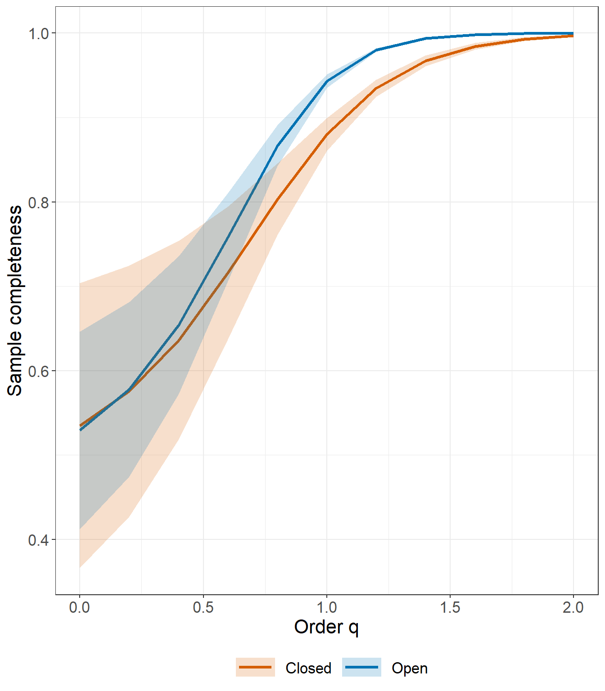
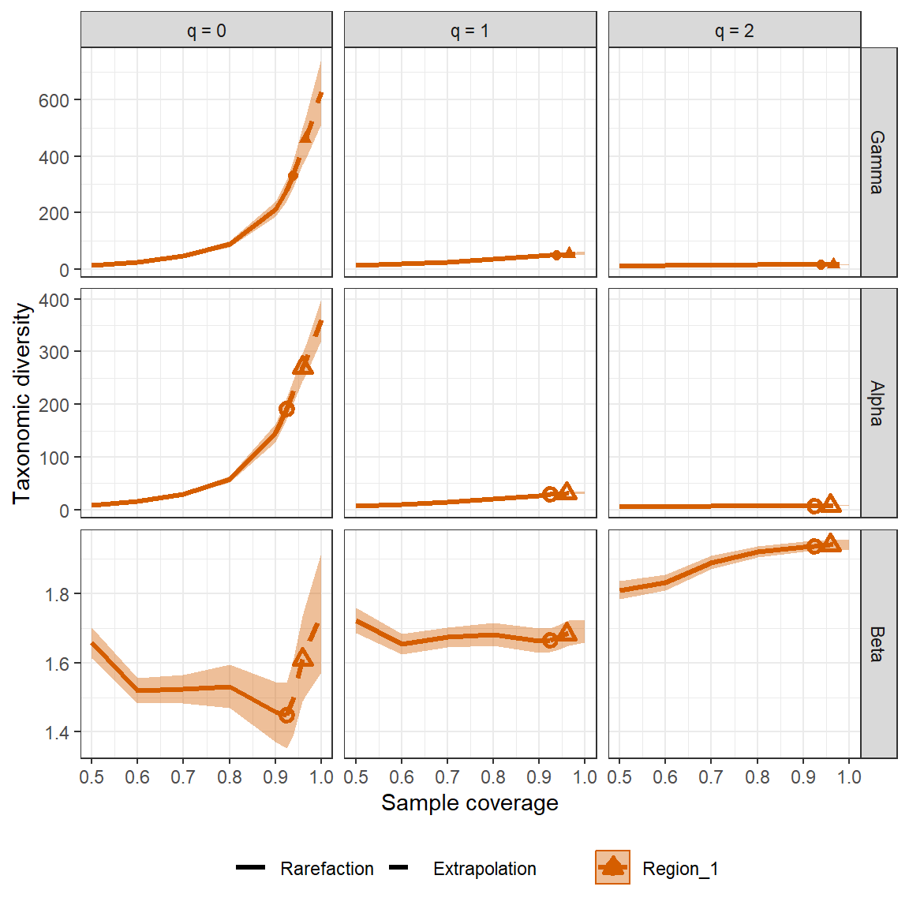
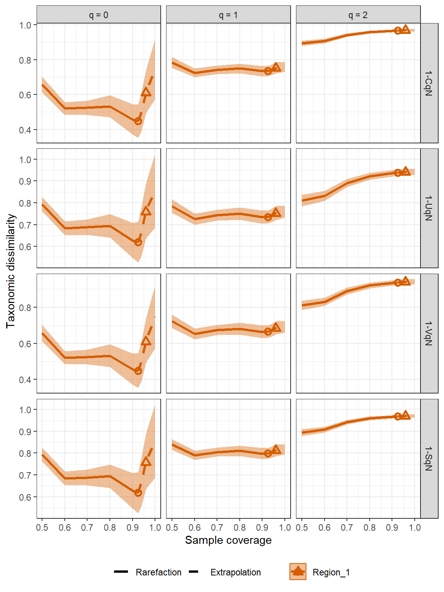

<!-- README.md is generated from README.Rmd. Please edit that file -->

# iNEXT.link (R package)

<h5 align="right">
Latest version: 2023-04-10
</h5>
<font color="394CAE">
<h3 color="394CAE" style="font-weight: bold">
Introduction to iNEXT.link (R package): Excerpt from iNEXT.link
UserGuide
</h3>
</font> <br>
<h5>
<b>Anne Chao, K.S. Hu, K.W. Chen, C.G. Lo, S.Y. Wang</b> <br><br>
<i>Institute of Statistics, National Tsing Hua University, Hsin-Chu,
Taiwan 30043</i>
</h5>

<br> `iNEXT.link` is an R package that extends the concepts of iNEXT.3D,
iNEXT.4step and iNEXT.beta3D to ecological networks. In this document,
we provide a brief overview of `iNEXT.link` and its functionalities.
Detailed information about the `iNEXT.link` functions can be found in
the `iNEXT.link` manual, which is also available on
[Github](https://github.com/AnneChao). For users without an R
background, an online version(“<https://chao.shinyapps.io/iNEXT_link/>”)
of `iNEXT.link` is also available.

`iNEXT.link` is primarily designed to calculate and analyze various
measures of diversity in ecological networks. Specifically, the package
calculates three Hill numbers of order q (species richness, Shannon
diversity, and Simpson diversity), as well as phylogenetic and
functional diversity levels.

For single ecological networks, `iNEXT.link` provides tools for
analyzing diversity. The package provides two types of rarefaction and
extrapolation (R/E) sampling curves to estimate diversity and confidence
intervals for single ecological networks. These include
sample-size-based (or size-based) R/E curves and coverage-based R/E
curves.

Moreover, `iNEXT.link` offers dissimilarity-turnover curves for the
coverage-based R/E curves for gamma, alpha, and beta diversity measures,
which can be used to compare diversity patterns across different
ecological networks.

### SOFTWARE NEEDED TO RUN INEXT.3D IN R

-   Required: [R](http://cran.rstudio.com/)
-   Suggested: [RStudio IDE](http://www.rstudio.com/ide/download/)

## HOW TO RUN iNEXT.link:

The `iNEXT.link` package can be downloaded from Anne Chao’s
[iNEXT.link_github](https://github.com/AnneChao/iNEXT.link) using the
following commands. For a first-time installation, additional
visualization extension packages (`ggplot2`) from CRAN and (`iNEXT.3D`),
(`iNEXT.4steps`), and (`iNEXT.beta3D`) from Anne Chao’s github must be
installed and loaded.

``` r
## install the latest version from github
install.packages('devtools')
library(devtools)

# install_github('AnneChao/iNEXT.3D')
# install_github('AnneChao/iNEXT.4steps')
# install_github('AnneChao/iNEXT.beta3D')

install_github('AnneChao/iNEXT.link')

## import packages
library(iNEXT.link)
```

In this document, we provide a quick introduction demonstrating how to
run the package `iNEXT.link`(iNterpolation and EXTrapolation in Network
diversity). `iNEXT.link` has several main functions:

## For Single community:

-   **iNEXT.link** : Computes taxonomic, phylogenetic, and functional
    diversity estimates and sample coverage estimates.

-   **DataInfo.link** : exhibits basic data information

-   **estimateD.link** : computes species diversity with a particular
    user-specified level of sample size or sample coverage.

-   **AO.link**:compute asymptotic (or observed) diversity of order q.

-   **Completeness.link** : Calculates estimated sample completeness
    with order q.

-   **Spec.link** : Computes specialization estimation (observed) with
    order q.

## For Multi-community:

-   **iNEXTbeta.link** : Computing standardized gamma, alpha, beta
    diversity, and four dissimilarity-turnover indices for three
    dimensions: taxonomic, phylogenetic and functional diversity at
    specified sample coverage or sample size.

## Visualizing Results:

-   **ggCompleteness.link** : Visualizing the output from the function
    `Completeness.link`

-   **ggSpec.link** : Visualizing the output from the function
    `Spec.link`

-   **ggAO.link** : Visualizing the output from the function `AO.link`

-   **ggiNEXT.link** : Visualizing the output from the function
    `iNEXT.link`

-   **ggiNEXTbeta.link** : Visualizing the output from the function
    `iNEXTbeta.link`

First, we load data from `iNEXT.link`:

### SINGLE COMMUNITY FUNCTION: iNEXT.link()

We first describe the main function `iNEXT.link()` with default
arguments:

<br> iNEXT.link(data,diversity = “TD”, q = c(0, 1, 2), size = NULL, nT =
NULL, endpoint = NULL, knots = 40, conf = 0.95, nboot = 30, row.tree =
NULL, col.tree = NULL, PDtype = “meanPD”, row.distM = NULL, col.distM =
NULL, FDtype = “AUC”, FDtau = NULL) <br>

The arguments of this function are briefly described below, and will be
explained in more details by illustrative examples in later text.This
main function computes diversity estimates of order q, the sample
coverage estimates and related statistics for K (if `knots = K`)
evenly-spaced knots (sample sizes) between size 1 and the `endpoint`,
where the endpoint is described below. Each knot represents a particular
sample size for which diversity estimates will be calculated. By
default, endpoint = double the reference sample size (total sample size
for abundance data). For example, if `endpoint = 10`, `knot = 4`,
diversity estimates will be computed for a sequence of samples with
sizes (1, 4, 7, 10).

This function returns an “iNEXT.link” object which can be further used
to make plots using the function ggiNEXT.link() to be described below.

<table class="gmisc_table" style="border-collapse: collapse; margin-top: 1em; margin-bottom: 1em;">
<thead>
<tr>
<th style="font-weight: 900; border-bottom: 1px solid grey; border-top: 2px solid grey; text-align: center;">
Argument
</th>
<th style="font-weight: 900; border-bottom: 1px solid grey; border-top: 2px solid grey; text-align: center;">
Description
</th>
</tr>
</thead>
<tbody>
<tr>
<td style="text-align: left;">
data
</td>
<td style="text-align: left;">
a list of data.frames, each data.frames represents
col.species-by-row.species abundance matrix.
</td>
</tr>
<tr>
<td style="text-align: left;">
diversity
</td>
<td style="text-align: left;">
selection of diversity type: ‘TD’ = Taxonomic diversity, ‘PD’ =
Phylogenetic diversity, and ‘FD’ = Functional diversity.
</td>
</tr>
<tr>
<td style="text-align: left;">
q
</td>
<td style="text-align: left;">
a numerical vector specifying the diversity orders. Default is c(0, 1,
2).
</td>
</tr>
<tr>
<td style="text-align: left;">
size
</td>
<td style="text-align: left;">
an integer vector of sample sizes for which diversity estimates will be
computed. If NULL, then diversity estimates will be calculated for those
sample sizes determined by the specified/default endpoint and knots.
</td>
</tr>
<tr>
<td style="text-align: left;">
endpoint
</td>
<td style="text-align: left;">
an integer specifying the sample size that is the endpoint for R/E
calculation; If NULL, then endpoint=double the reference sample size;
</td>
</tr>
<tr>
<td style="text-align: left;">
knots
</td>
<td style="text-align: left;">
an integer specifying the number of equally-spaced knots between size 1
and the endpoint. Default is 40.
</td>
</tr>
<tr>
<td style="text-align: left;">
conf
</td>
<td style="text-align: left;">
a positive number \< 1 specifying the level of confidence interval.
Default is 0.95.
</td>
</tr>
<tr>
<td style="text-align: left;">
nboot
</td>
<td style="text-align: left;">
a positive integer specifying the number of bootstrap replications when
assessing sampling uncertainty and constructing confidence intervals.
Enter 0 to skip the bootstrap procedures. Default is 30.
</td>
</tr>
<tr>
<td style="text-align: left;">
row.tree
</td>
<td style="text-align: left;">
(required only when diversity = ‘PD’ a phylogenetic tree of row
assemblage in the pooled network row assemblage.
</td>
</tr>
<tr>
<td style="text-align: left;">
col.tree
</td>
<td style="text-align: left;">
(required only when diversity = ‘PD’) a phylogenetic tree of column
assemblage in the pooled network column assemblage.
</td>
</tr>
<tr>
<td style="text-align: left;">
PDtype
</td>
<td style="text-align: left;">
(required only when diversity = ‘PD’), select PD type: PDtype = ‘PD’
(effective total branch length) or PDtype = ‘meanPD’ (effective number
of equally divergent lineages). Default is ‘meanPD’, where meanPD =
PD/tree depth.
</td>
</tr>
<tr>
<td style="text-align: left;">
row.distM
</td>
<td style="text-align: left;">
(required only when </code>diversity = ‘FD’) a species pairwise distance
matrix for all species of row assemblage in the pooled network row
assemblage.
</td>
</tr>
<tr>
<td style="text-align: left;">
col.distM
</td>
<td style="text-align: left;">
(required only when diversity = ‘FD’) a species pairwise distance matrix
for all species of column assemblage in the pooled network column
assemblage.
</td>
</tr>
<tr>
<td style="text-align: left;">
FDtype
</td>
<td style="text-align: left;">
(required only when diversity = ‘FD’), select FD type: FDtype =
‘tau_values’ for FD under specified threshold values, or FDtype = ‘AUC’
(area under the curve of tau-profile) for an overall FD which integrates
all threshold values between zero and one. Default is ‘AUC’.
</td>
</tr>
<tr>
<td style="border-bottom: 2px solid grey; text-align: left;">
FDtau
</td>
<td style="border-bottom: 2px solid grey; text-align: left;">
(required only when diversity = ‘FD’ and FDtype = ‘tau_values’), a
numerical vector between 0 and 1 specifying tau values (threshold
levels). If NULL (default), then threshold is set to be the mean
distance between any two individuals randomly selected from the pooled
assemblage (i.e., quadratic entropy).
</td>
</tr>
</tbody>
</table>

## DATA FORMAT/INFORMATION

Supported Data Types:

Individual-based abundance data : Input data for each assemblage/site
include samples species abundances in an empirical sample of n
individuals (“reference sample”). When dealing with N assemblages, the
input data consists of N lists of species abundances

## RAREFACTION/EXTRAPOLATION VIA EXAMPLES

The data sets (tree-beetles interaction data ) are included in
iNEXT.link package. The experiment took place in the Steigerwald forest
in Germany, where deadwood objects from six tree species were exposed in
open and closed habitats. Saproxilic beetles were sampled using stem
emergence traps and classified according to their functional traits.
Data from four years were pooled for each plot and habitat, and pairwise
distances were computed from the Gower distance. Here, the demonstration
only uses data from plot A. For these data, the following commands
display the sample species abundances and run the `iNEXT.link()`
function for three types of diversty (`"TD"`, `"PD"`, `"FD"` with
threshold dmean, `"AUC"` which integate FD from threshold 0-1) in
`q = 0`.

If one diversity class required, then `iNEXT.link()` function returns
including: `$Info` for summarizing data information; `$iNextEst` for
showing diversity estimates along with related statistics for a series
of rarefied and extrapolated samples; and `$AsyEst` for showing
asymptotic diversity estimates along with related statistics, otherwise,
returns lists which length equal to the number of diversity class
required and also named by diversity class. Among each list include
three data frames:`$Info`, `$iNextEst` and `$AsyEst`.

`$Info`, as shown below, returns basic data information. It can also be
presented using function `DataInfo()` (for “TD”), `PDInfo()` (for “PD”)
and `AUCInfo()` (for “FD”).

Because the three kinds of diversity output are similar therefore the
demo shows only TD.

``` r
linkoutTD = iNEXT.link(data = beetles,diversity = 'TD', q = c(0,1,2),nboot = 30)
linkoutTD$DataInfo
  Networks    n S.obs(row) S.obs(col) Links.obs Connectance Coverage  f1 f2 f3 f4 f5 f6 f7 f8 f9 f10
1   Closed  816          6         83       178      0.3574   0.8800  98 31 15  3  3  5  0  2  2   1
2     Open 1932          6         88       206      0.3902   0.9431 110 33 15  8  7  5  3  2  3   2
```

Diversity estimates and related statistics are computed for these 40
knots, which locates the reference sample at the midpoint of the
selected knots. If the argument se=TRUE, then the bootstrap method is
applied to obtain the 95% confidence intervals for each diversity and
sample coverage estimates.

For the sample size corresponding to each knot, the first data frame of
list `$iNextEst` (as shown below for “size_based”) under each diversity
class includes the sample size (`m`, i.e., each of the 40 knots), the
method (`interpolated`, `observed`, or `extrapolated`, depending on
whether the size `m` is less than, equal to, or greater than the
reference sample size), the diversity order, the diversity estimate of
order q (`qD`, `qPD`, `qFD` and `qAUC`), the 95% lower and upper
confidence limits of diversity (`qD.LCL` with`qD.UCL`, `qPD.LCL` with
`qPD.UCL`, `qFD.LCL` with `qFD.UCL` and `qAUC.LCL` with `qAUC.UCL`), and
the sample coverage estimate (`SC`) along with the 95% lower and upper
confidence limits of sample coverage (`SC.LCL`, `SC.UCL`). These sample
coverage estimates with confidence intervals are used for plotting the
sample completeness curve.

``` r
head(linkoutTD$iNextEst$size_based)
# A tibble: 6 x 10
  Assemblage     m Method      Order.q    qD qD.LCL qD.UCL     SC SC.LCL SC.UCL
  <chr>      <dbl> <chr>         <dbl> <dbl>  <dbl>  <dbl>  <dbl>  <dbl>  <dbl>
1 Closed         1 Rarefaction       0   1      1      1   0.0295 0.0241 0.0348
2 Closed        43 Rarefaction       0  28.0   26.6   29.5 0.543  0.506  0.580 
3 Closed        86 Rarefaction       0  44.8   42.0   47.6 0.661  0.632  0.689 
4 Closed       129 Rarefaction       0  58.2   54.3   62.0 0.713  0.688  0.739 
5 Closed       172 Rarefaction       0  69.8   65.0   74.6 0.745  0.722  0.768 
6 Closed       215 Rarefaction       0  80.2   74.6   85.9 0.767  0.746  0.789 
```

The second data frame of list `$iNextEst` (as shown below for
“coverage_based”) under each class includes real sample coverage (“SC”),
sample size (`m`, i.e., each of the 40 knots), the method
(`Rarefaction`, `Observed`, or `Extrapolation`, depending on whether the
size `m` is less than, equal to, or greater than the reference sample
size),the diversity estimate of order q (qD, qPD, qFD and qAUC)
conditioning on “SC”, the 95% lower and upper confidence limits of
diversity (`qD.LCL` with `qD.UCL`, `qPD.LCL` with `qPD.UCL`, `qFD.LCL`
with `qFD.UCL` and `qAUC.LCL` with `qAUC.UCL`). These sample coverage
estimates with confidence intervals are used for plotting the
coverage-based R/E curves.

``` r
head(linkoutTD$iNextEst$coverage_based)
# A tibble: 6 x 8
  Assemblage     SC      m Method      Order.q    qD qD.LCL qD.UCL
  <chr>       <dbl>  <dbl> <chr>         <dbl> <dbl>  <dbl>  <dbl>
1 Closed     0.0295   1.00 Rarefaction       0  1.00  0.913   1.09
2 Closed     0.543   43.0  Rarefaction       0 28.0  23.2    32.9 
3 Closed     0.661   86.0  Rarefaction       0 44.8  36.8    52.8 
4 Closed     0.713  129.   Rarefaction       0 58.2  47.7    68.7 
5 Closed     0.745  172.   Rarefaction       0 69.8  57.2    82.4 
6 Closed     0.767  215.   Rarefaction       0 80.2  65.9    94.6 
```

`$AsyEst` lists the observed diversity, asymptotic estimates, estimated
bootstrap s.e. and 95% confidence intervals for Hill numbers with q =
0(`Species richness`), 1(`Shannon diversity`), and
2(`Simpson diversity`). The estimated asymptotes and the observed
diversity are calculated via the functions `AO.link()` . The output for
the dunes data is shown below. All row and column variables are
self-explanatory.

``` r
head(linkoutTD$AsyEst)
  Assemblage         Diversity   Observed  Estimator       s.e.        LCL        UCL
1     Closed  Species richness 178.000000 332.713393 28.3104471 277.225937 388.200850
2     Closed Shannon diversity  64.690053  80.316088  5.0058894  70.504725  90.127451
3     Closed Simpson diversity  32.627205  33.944467  2.2460690  29.542253  38.346682
4       Open  Species richness 206.000000 389.238440 46.0252893 299.030531 479.446350
5       Open Shannon diversity  23.311453  25.911799  1.2732378  23.416299  28.407299
6       Open Simpson diversity   8.059978   8.089554  0.3115779   7.478873   8.700235
```

## GRAPHIC DISPLAYS: FUNCTION ggiNEXT.link()

The function `ggiNEXT.link()`, which extends `ggplot2` with default
arguments, is described as follows:

<br> ggiNEXT.link(outcome, type = 1:3,facet.var = “Assemblage”,
color.var = “Order.q”)  
<br>

Here `outcome` is the object of `iNEXT.link()`’s output. Three types of
curves are allowed for different diversity classes:

1.  Sample-size-based R/E curve (`type=1`): see Figs. 1a and 2a in the
    main text. This curve plots diversity estimates with confidence
    intervals (if `se=TRUE`) as a function of sample size up to double
    the reference sample size, by default, or a user-specified
    `endpoint`.

2.  Sample completeness curve (`type=2`) with confidence intervals (if
    `se=TRUE`): see Figs. 1b and 2b in the main text. This curve plots
    the sample coverage with respect to sample size for the same range
    described in (1).

3.  Coverage-based R/E curve (`type=3`): see Figs. 1c and 2c in the main
    text. This curve plots the diversity estimates with confidence
    intervals (if `se=TRUE`) as a function of sample coverage up to the
    maximum coverage obtained from the maximum size described in (1).

The argument `facet.var=("Order.q", "Assemblage")` is used to create a
separate plot for each value of the specified variable. For example, the
following code displays a separate plot (in Figs 1a and 1c) for each
value of the diversity order q. The `ggiNEXT.link()` function is a
wrapper around `ggplot2` package to create a R/E curve using a single
line of code. The resulting object is of class `"ggplot"`, so can be
manipulated using the `ggplot2` tools.

The argument `facet.var="Assemblage"` in `ggiNEXT.link` function creates
a separate plot for each assembalge, therefore the different Order.q
will seperated by different colours as shown below:

``` r
# Sample-size-based R/E curves, separating by "assemblage""
ggiNEXT.link(linkoutTD, type = 1, facet.var = "Assemblage")
[[1]]
```


The argument `facet.var="Order.q"` in `ggiNEXT.link` function creates a
separate plot for each order, therefore six assemblages will be
seperated by different colours as shown below:

``` r
# Sample-size-based R/E curves, separating by "Order.q"
ggiNEXT.link(linkoutTD, type = 1, facet.var = "Order.q")
[[1]]
```


The following commands return the sample completeness curve in which
different colors are used for the six assemblages. Since the sample
completeness curve are same for differnet class of diversity,
`ggiNEXT.link` returns only one plot:

``` r
ggiNEXT.link(linkoutTD, type = 2, facet.var = "Order.q", color.var="Assemblage")
[[1]]
```


The following commands return the coverage-based R/E sampling curves in
which different colors are used for the six assemblages
(`facet.var="Assemblage"`) and for three orders(`facet.var="Order.q"`)

``` r
ggiNEXT.link(linkoutTD, type = 3, facet.var="Assemblage")
[[1]]
```


``` r
ggiNEXT.link(linkoutTD, type = 3, facet.var="Order.q")
[[1]]
```


## DATA INFORMATION FUNCTION: DataInfo.link()

We can supply the function

<br> DataInfo.link(data, diversity = “TD”, row.tree = NULL, col.tree =
NULL, row.distM = NULL, col.distM = NULL) <br>

to compute three type diversity(‘TD’,‘PD’,‘FD’) data information, which
including sample size, observed species richness, sample coverage
estimate, and the first ten abundance frequency counts, and so on.

``` r
DataInfo.link(beetles, diversity = 'TD')
  Networks    n S.obs(row) S.obs(col) Links.obs Connectance Coverage  f1 f2 f3 f4 f5 f6 f7 f8 f9 f10
1   Closed  816          6         83       178      0.3574   0.8800  98 31 15  3  3  5  0  2  2   1
2     Open 1932          6         88       206      0.3902   0.9431 110 33 15  8  7  5  3  2  3   2
DataInfo.link(beetles, diversity = 'PD', col.tree = beetles_col_tree)
  Networks    n S.obs(row) S.obs(col) Links.obs Connectance f1* f2*       g1       g2 PD.obs mean_T
1   Closed  816          6         83       178      0.3574  98  31 11508.99 3873.052    924    285
2     Open 1932          6         88       206      0.3902 110  33 13918.45 5172.410   1014    285
DataInfo.link(beetles, diversity = 'FD', col.distM = beetles_col_distM)
  Networks    n S.obs(row) S.obs(col) Links.obs Connectance  f1 f2 a1' a2' threshold
1   Closed  816          6         83       178      0.3574  98 31   0   0  8.930741
2     Open 1932          6         88       206      0.3902 110 33   0   0  8.021019
```

## POINT ESTIMATION FUNCTION: estimateD.link()

We also supply the function

<br> estimateD.link(data, diversity = “TD”, q = c(0, 1, 2),  
base = “coverage”, level = NULL, nboot = 50, conf = 0.95, PDtype =
“meanPD”, row.tree = NULL, col.tree = NULL, row.distM = NULL, col.distM
= NULL, FDtype = “AUC”, FDtau = NULL) <br>

to compute three type diversity(‘TD’,‘PD’,‘FD’) estimates with q = 0, 1,
2 for any particular level of sample size (`base="size"`) or any
specified level of sample coverage (`base="coverage"`) for abundance
data . If `level=NULL`, this function computes the diversity estimates
for the minimum sample size/coverage among all assemblages.

For example, the following command returns the taxonomic diversity
(‘TD’) with a specified level of sample coverage of 70% for the
tree-beetles interaction data. For some assemblages, this coverage value
corresponds to the rarefaction part whereas the others correspond to
extrapolation, as indicated in the method of the output.

``` r
estimateD.link(beetles, diversity = 'TD', q = c(0,1,2), base = "coverage",level = 0.7)
  Assemblage  SC         m      Method Order.q        qD      s.e.    qD.LCL    qD.UCL
1     Closed 0.7 115.47429 Rarefaction       0 54.183847 4.4243142 45.512351 62.855344
2     Closed 0.7 115.47429 Rarefaction       1 37.823241 2.7817812 32.371050 43.275432
3     Closed 0.7 115.47429 Rarefaction       2 26.409739 1.8513187 22.781220 30.038257
4       Open 0.7  41.05942 Rarefaction       0 17.426867 1.3435812 14.793496 20.060238
5       Open 0.7  41.05942 Rarefaction       1 10.562168 0.5879382  9.409831 11.714506
6       Open 0.7  41.05942 Rarefaction       2  6.898403 0.2732411  6.362860  7.433946
```

## ASYMPTOTIC AND OBSERVED DIVERSITY FUNCTION: AO.link

<br> AO.link(data, diversity = “TD”, q = seq(0, 2, 0.2), nboot = 30,
conf = 0.95, method = c(“Asymptotic”, “Observed”), row.tree = NULL,
col.tree = NULL, PDtype = “meanPD”, row.distM = NULL, col.distM = NULL,
FDtype = “AUC”, FDtau = NULL) <br>

The function `AO.link()` can compute three type
diversity(‘TD’,‘PD’,‘FD’),which including empirical diversity and
asymptotic diversity. For any specified level of q can be compute.

For example, the following command returns an empirical taxonomic
diversity(‘TD’) and asymptotic taxonomic diversity(‘TD’) for dunes data,
along with its confidence interval, for a specified q level from 0 to 2.

``` r
out1 <- AO.link(beetles, diversity = 'TD', q = seq(0, 2, 0.2), method = c("Asymptotic", "Observed"),
                nboot = 5,conf = 0.95)

out1
   Order.q         qD       s.e.     qD.LCL     qD.UCL Network     Method
1      0.0 332.713393 33.9763104 314.715119 386.183778  Closed Asymptotic
2      0.2 265.977501 24.0172018 251.715410 303.702598  Closed Asymptotic
3      0.4 203.167245 15.8860259 191.904348 227.848934  Closed Asymptotic
4      0.6 149.540048 10.1002003 140.654719 164.730418  Closed Asymptotic
5      0.8 108.592546  6.5883357 101.535898 117.829106  Closed Asymptotic
6      1.0  80.316088  4.7353808  74.640719  86.380849  Closed Asymptotic
7      1.2  61.983531  3.7924706  57.327031  66.344344  Closed Asymptotic
8      1.4  50.295815  3.2542819  46.329640  53.683848  Closed Asymptotic
9      1.6  42.699384  2.8943068  39.188580  45.744334  Closed Asymptotic
10     1.8  37.568079  2.6304707  34.376724  40.445198  Closed Asymptotic
11     2.0  33.944467  2.4321414  30.972156  36.656956  Closed Asymptotic
12     0.0 389.238440 25.7695985 368.950753 419.614993    Open Asymptotic
13     0.2 263.223968 15.3143642 249.564315 280.381533    Open Asymptotic
14     0.4 159.174040  7.9094381 150.628483 168.601683    Open Asymptotic
15     0.6  86.647814  3.8045883  82.010864  90.721521    Open Asymptotic
16     0.8  45.571274  1.9786723  43.251229  48.011159    Open Asymptotic
17     1.0  25.911799  1.1579828  24.693726  27.569131    Open Asymptotic
18     1.2  16.963237  0.7524340  16.225017  18.071670    Open Asymptotic
19     1.4  12.643810  0.5426228  12.124167  13.430006    Open Asymptotic
20     1.6  10.333946  0.4266571   9.923978  10.933100    Open Asymptotic
21     1.8   8.967960  0.3569329   8.623544   9.454416    Open Asymptotic
22     2.0   8.089554  0.3116692   7.788035   8.504167    Open Asymptotic
23     0.0 178.000000 10.3344085 164.400000 189.000000  Closed  Empirical
24     0.2 149.140436  9.3591022 136.687335 159.398179  Closed  Empirical
25     0.4 122.284123  8.2462369 111.168394 131.485232  Closed  Empirical
26     0.6  98.784711  7.0760083  89.113283 106.723166  Closed  Empirical
27     0.8  79.539008  5.9523008  71.292189  86.176214  Closed  Empirical
28     1.0  64.690053  4.9660908  57.724088  70.145808  Closed  Empirical
29     1.2  53.711702  4.1634827  47.809668  58.194544  Closed  Empirical
30     1.4  45.761569  3.5430160  40.695814  49.491664  Closed  Empirical
31     1.6  40.008527  3.0755911  35.580914  43.172413  Closed  Empirical
32     1.8  35.788959  2.7252967  31.843937  38.527422  Closed  Empirical
33     2.0  32.627205  2.4606368  29.048824  35.040611  Closed  Empirical
34     0.0 206.000000  6.4265076 197.200000 212.300000    Open  Empirical
35     0.2 147.911160  4.7682863 141.774671 153.581184    Open  Empirical
36     0.4  98.276240  3.3383330  94.610688 102.927324    Open  Empirical
37     0.6  60.906771  2.2294870  59.136257  64.279110    Open  Empirical
38     0.8  36.832763  1.4445257  35.507725  39.008829    Open  Empirical
39     1.0  23.311453  0.9313249  22.281398  24.626460    Open  Empirical
40     1.2  16.195155  0.6205939  15.424552  16.993636    Open  Empirical
41     1.4  12.394607  0.4391408  11.812373  12.905136    Open  Empirical
42     1.6  10.237828  0.3315413   9.781227  10.586516    Open  Empirical
43     1.8   8.920980  0.2648573   8.547761   9.174783    Open  Empirical
44     2.0   8.059978  0.2213207   7.743510   8.255013    Open  Empirical
```

## GRAPHIC DISPLAYS FUNCTION: ggAO.link()

Plots q-profile, time-profile, and tau-profile based on the outcome of
AO.link using the ggplot2 package.

The function `ggAO.link()`, which extends `ggplot2` with default
arguments, is described as follows:

<br> ggAO.link(outcome) <br>

Here `outcome` is the object of `AO.link`’s output .

``` r
# q profile curve""
ggAO.link(out1)
```


## SINGLE COMMUNITY FUNCTION: Completeness.link()

Function `Completeness.link()` provides a easy way to compute estimated
sample completeness with order q. It has default arguments: <br>
Completeness.link(data, q = seq(0, 2, 0.2), nboot = 30, conf = 0.95)
<br>

## GRAPHIC DISPLAYS FUNCTION: ggCompleteness.link()

We also provides a realized function `ggCompleteness.link` to plot the
output from `Completeness.link()`:

<br>ggCompleteness.link(output) <br>

We use data beetles to calculate sample completeness and plot it.

``` r
out1 <- Completeness.link(data = beetles)
ggCompleteness.link(out1)
```



## SINGLE COMMUNITY FUNCTION: Spec.link()

We describe the main function `Spec.link()` with default arguments:

<br> Spec.link(data, q = seq(0, 2, 0.2), method = “Estimated”, nboot =
30, conf = 0.95, E.class = c(1:5), C = NULL) <br>

## GRAPHIC DISPLAYS FUNCTION: ggSpec.link()

We provide a function `ggSpec.link()` to plot the output from
`Spec.link()`.

<br> ggSpec.link(output) <br>

There are an example for funciton `Spec.link` and function
`ggSpec.link`.

``` r
out1 <- Spec.link(data = beetles)
ggSpec.link(out1)
```


### Multi-community

## MULTI-COMMUNITY FUNCTION: iNEXTbeta.link()

``` r
iNEXTbeta.link(data, diversity = "TD", level = seq(0.5, 1, 0.05), 
               q = c(0, 1, 2), nboot = 20, conf = 0.95, 
               PDtype = "meanPD", row.tree = NULL, col.tree = NULL, row.distM = NULL, 
               col.distM = NULL, FDtype = "AUC", FDtau = NULL, FDcut_number = 30) 
```

<table class="gmisc_table" style="border-collapse: collapse; margin-top: 1em; margin-bottom: 1em;">
<thead>
<tr>
<th style="font-weight: 900; border-bottom: 1px solid grey; border-top: 2px solid grey; text-align: center;">
Argument
</th>
<th style="font-weight: 900; border-bottom: 1px solid grey; border-top: 2px solid grey; text-align: center;">
Description
</th>
</tr>
</thead>
<tbody>
<tr>
<td style="text-align: left;">
data
</td>
<td style="text-align: left;">
data can be input as a matrix/data.frame (species by assemblages), or a
list of matrices/data.frames, each matrix represents
species-by-assemblages abundance matrix
</td>
</tr>
<tr>
<td style="text-align: left;">
diversity
</td>
<td style="text-align: left;">
selection of diversity type: ‘TD’ = Taxonomic diversity, ‘PD’ =
Phylogenetic diversity, and ‘FD’ = Functional diversity.
</td>
</tr>
<tr>
<td style="text-align: left;">
level
</td>
<td style="text-align: left;">
a sequence specifying the particular sample coverages (between 0 and 1).
Default is seq(0.5, 1, 0.05).
</td>
</tr>
<tr>
<td style="text-align: left;">
q
</td>
<td style="text-align: left;">
a numerical vector specifying the diversity orders. Default is c(0, 1,
2).
</td>
</tr>
<tr>
<td style="text-align: left;">
nboot
</td>
<td style="text-align: left;">
a positive integer specifying the number of bootstrap replications when
assessing sampling uncertainty and constructing confidence intervals.
Bootstrap replications are generally time consuming. Enter 0 to skip the
bootstrap procedures. Default is 30.
</td>
</tr>
<tr>
<td style="text-align: left;">
conf
</td>
<td style="text-align: left;">
a positive number \< 1 specifying the level of confidence interval.
Default is 0.95.
</td>
</tr>
<tr>
<td style="text-align: left;">
PDtype
</td>
<td style="text-align: left;">
(required only when diversity = ‘PD’), select PD type: PDtype = ‘PD’
(effective total branch length) or PDtype = ‘meanPD’ (effective number
of equally divergent lineages). Default is ‘meanPD’, where meanPD =
PD/tree depth.
</td>
</tr>
<tr>
<td style="text-align: left;">
row.tree
</td>
<td style="text-align: left;">
(required only when diversity = ‘PD’ a phylogenetic tree of row
assemblage in the pooled network row assemblage.
</td>
</tr>
<tr>
<td style="text-align: left;">
col.tree
</td>
<td style="text-align: left;">
(required only when diversity = ‘PD’) a phylogenetic tree of column
assemblage in the pooled network column assemblage.
</td>
</tr>
<tr>
<td style="text-align: left;">
row.distM
</td>
<td style="text-align: left;">
(required only when </code>diversity = ‘FD’) a species pairwise distance
matrix for all species of row assemblage in the pooled network row
assemblage.
</td>
</tr>
<tr>
<td style="text-align: left;">
col.distM
</td>
<td style="text-align: left;">
(required only when diversity = ‘FD’) a species pairwise distance matrix
for all species of column assemblage in the pooled network column
assemblage.
</td>
</tr>
<tr>
<td style="text-align: left;">
FDtype
</td>
<td style="text-align: left;">
(required only when diversity = ‘FD’), select FD type: FDtype =
‘tau_values’ for FD under specified threshold values, or FDtype = ‘AUC’
(area under the curve of tau-profile) for an overall FD which integrates
all threshold values between zero and one. Default is ‘AUC’.
</td>
</tr>
<tr>
<td style="border-bottom: 2px solid grey; text-align: left;">
FDtau
</td>
<td style="border-bottom: 2px solid grey; text-align: left;">
(required only when diversity = ‘FD’ and FDtype = ‘tau_values’), a
numerical vector between 0 and 1 specifying tau values (threshold
levels). If NULL (default), then threshold is set to be the mean
distance between any two individuals randomly selected from the pooled
assemblage (i.e., quadratic entropy).
</td>
</tr>
</tbody>
</table>

the `iNEXTbeta.link()` function returns the `"iNEXTbeta.link"` object
including seven data frames for each regions:

-   gamma
-   alpha
-   beta
-   C ( Sorensen-type non-overlap )
-   U ( Jaccard-type non-overlap )
-   V ( Sorensen-type turnover )
-   S ( Jaccard-type turnover )

``` r
# Taxonomic diversity
Abundance_TD = iNEXTbeta.link(data = beetles, diversity = 'TD', q = c(0, 1, 2))
Abundance_TD
```

    $gamma
      Estimate Order.q      Method  SC   Size  s.e.    LCL    UCL   Region diversity
    1   13.978       0 Rarefaction 0.5 20.941 0.889 12.235 15.722 Region_1        TD
    2   11.552       1 Rarefaction 0.5 20.941 0.685 10.210 12.894 Region_1        TD
    3    9.072       2 Rarefaction 0.5 20.941 0.484  8.124 10.020 Region_1        TD
    4   24.932       0 Rarefaction 0.6 45.591 1.615 21.766 28.097 Region_1        TD
    5   17.460       1 Rarefaction 0.6 45.591 1.009 15.482 19.438 Region_1        TD
    6   11.614       2 Rarefaction 0.6 45.591 0.577 10.484 12.744 Region_1        TD

    $alpha
      Estimate Order.q      Method  SC   Size  s.e.    LCL    UCL   Region diversity
    1    8.432       0 Rarefaction 0.5 25.949 0.480  7.491  9.373 Region_1        TD
    2    6.706       1 Rarefaction 0.5 25.949 0.349  6.023  7.390 Region_1        TD
    3    5.011       2 Rarefaction 0.5 25.949 0.229  4.563  5.460 Region_1        TD
    4   16.403       0 Rarefaction 0.6 61.802 0.847 14.742 18.063 Region_1        TD
    5   10.562       1 Rarefaction 0.6 61.802 0.477  9.626 11.497 Region_1        TD
    6    6.342       2 Rarefaction 0.6 61.802 0.254  5.843  6.841 Region_1        TD

    $beta
      Estimate Order.q      Method  SC   Size  s.e.   LCL   UCL   Region diversity
    1    1.658       0 Rarefaction 0.5 25.949 0.023 1.613 1.702 Region_1        TD
    2    1.723       1 Rarefaction 0.5 25.949 0.019 1.686 1.759 Region_1        TD
    3    1.810       2 Rarefaction 0.5 25.949 0.013 1.784 1.836 Region_1        TD
    4    1.520       0 Rarefaction 0.6 61.802 0.019 1.483 1.557 Region_1        TD
    5    1.653       1 Rarefaction 0.6 61.802 0.015 1.623 1.683 Region_1        TD
    6    1.831       2 Rarefaction 0.6 61.802 0.012 1.809 1.854 Region_1        TD

    $C
      Estimate Order.q      Method  SC   Size  s.e.   LCL   UCL   Region diversity
    1    0.658       0 Rarefaction 0.5 25.949 0.023 0.613 0.702 Region_1        TD
    2    0.785       1 Rarefaction 0.5 25.949 0.016 0.754 0.815 Region_1        TD
    3    0.895       2 Rarefaction 0.5 25.949 0.008 0.879 0.911 Region_1        TD
    4    0.520       0 Rarefaction 0.6 61.802 0.019 0.483 0.557 Region_1        TD
    5    0.725       1 Rarefaction 0.6 61.802 0.013 0.699 0.751 Region_1        TD
    6    0.908       2 Rarefaction 0.6 61.802 0.007 0.894 0.922 Region_1        TD

    $U
      Estimate Order.q      Method  SC   Size  s.e.   LCL   UCL   Region diversity
    1    0.794       0 Rarefaction 0.5 25.949 0.016 0.761 0.826 Region_1        TD
    2    0.785       1 Rarefaction 0.5 25.949 0.016 0.754 0.815 Region_1        TD
    3    0.810       2 Rarefaction 0.5 25.949 0.013 0.784 0.836 Region_1        TD
    4    0.684       0 Rarefaction 0.6 61.802 0.016 0.652 0.716 Region_1        TD
    5    0.725       1 Rarefaction 0.6 61.802 0.013 0.699 0.751 Region_1        TD
    6    0.831       2 Rarefaction 0.6 61.802 0.012 0.809 0.854 Region_1        TD

    $V
      Estimate Order.q      Method  SC   Size  s.e.   LCL   UCL   Region diversity
    1    0.658       0 Rarefaction 0.5 25.949 0.023 0.613 0.702 Region_1        TD
    2    0.723       1 Rarefaction 0.5 25.949 0.019 0.686 0.759 Region_1        TD
    3    0.810       2 Rarefaction 0.5 25.949 0.013 0.784 0.836 Region_1        TD
    4    0.520       0 Rarefaction 0.6 61.802 0.019 0.483 0.557 Region_1        TD
    5    0.653       1 Rarefaction 0.6 61.802 0.015 0.623 0.683 Region_1        TD
    6    0.831       2 Rarefaction 0.6 61.802 0.012 0.809 0.854 Region_1        TD

    $S
      Estimate Order.q      Method  SC   Size  s.e.   LCL   UCL   Region diversity
    1    0.794       0 Rarefaction 0.5 25.949 0.016 0.761 0.826 Region_1        TD
    2    0.839       1 Rarefaction 0.5 25.949 0.013 0.814 0.864 Region_1        TD
    3    0.895       2 Rarefaction 0.5 25.949 0.008 0.879 0.911 Region_1        TD
    4    0.684       0 Rarefaction 0.6 61.802 0.016 0.652 0.716 Region_1        TD
    5    0.790       1 Rarefaction 0.6 61.802 0.011 0.768 0.812 Region_1        TD
    6    0.908       2 Rarefaction 0.6 61.802 0.007 0.894 0.922 Region_1        TD

The output contains seven data frames: `gamma`, `alpha`, `beta`, `C`,
`U`, `V`, `S`. For each data frame, it includes the diversity estimate
(`Estimate`), the diversity order (`Order.q`), `Method` (Rarefaction,
Observed, or Extrapolation, depending on whether the size `m` is less
than, equal to, or greater than the reference sample size), the sample
coverage estimate (`SC`), the sample size (`Size`), the standard error
from bootstrap replications (`s.e.`), the 95% lower and upper confidence
limits of diversity (`LCL`, `UCL`), and the name of region (`Region`).
These diversity estimates with confidence intervals are used for
plotting the diversity curve.

## GRAPHIC DISPLAYS FUNCTION: ggiNEXTbeta.link()

The function `ggiNEXTbeta.link()`, which extends `ggplot2` to the
`"iNEXT.link"` object with default arguments, is described as follows:

<table class="gmisc_table" style="border-collapse: collapse; margin-top: 1em; margin-bottom: 1em;">
<thead>
<tr>
<th style="font-weight: 900; border-bottom: 1px solid grey; border-top: 2px solid grey; text-align: center;">
Argument
</th>
<th style="font-weight: 900; border-bottom: 1px solid grey; border-top: 2px solid grey; text-align: center;">
Description
</th>
</tr>
</thead>
<tbody>
<tr>
<td style="text-align: left;">
output
</td>
<td style="text-align: left;">
the output of <code>iNEXTbeta.link</code>.
</td>
</tr>
<tr>
<td style="text-align: left;">
type
</td>
<td style="text-align: left;">
selection of plot type : type = ‘B’ for plotting the gamma, alpha, and
beta diversity; type = ‘D’ for plotting 4 turnover dissimilarities.
</td>
</tr>
<tr>
<td style="border-bottom: 2px solid grey; text-align: left;">
scale
</td>
<td style="border-bottom: 2px solid grey; text-align: left;">
Are scales shared across all facets (the default, ‘fixed’), or do they
vary across rows (‘free_x’), columns (‘free_y’), or both rows and
columns (‘free’)? Default is ‘free’.
</td>
</tr>
</tbody>
</table>

The `ggiNEXTbeta.link()` function is a wrapper around the `ggplot2`
package to create a R/E curve using a single line of code. The resulting
object is of class `"ggplot"`, so it can be manipulated using the
`ggplot2` tools. Users can visualize the output of beta diversity or
four dissimilarities by setting the parameter <code>**type**</code>:

``` r
ggiNEXTbeta.link(Abundance_TD, type = 'B')
```



``` r
ggiNEXTbeta.link(Abundance_TD, type = 'D')
```



### How to cite

-   Chiu, C-H., Chao, A., Vogel, S., Kriegel, P. and Thorn, S. (2023).
    Network-diversity quantification and related statistical estimation:
    drawing on sampling models and methodologies from biodiversity
    research. To appear in Philosophical Transactions of the Royal
    Society B.

### Referance

Chiu, C-H., Chao, A., Vogel, S., Kriegel, P. and Thorn, S. (2023).
Network-diversity quantification and related statistical estimation:
drawing on sampling models and methodologies from biodiversity research.
To appear in Philosophical Transactions of the Royal Society B.
